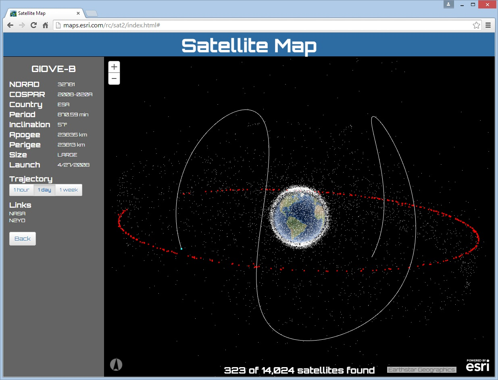

# Satellite Map

This application displays ALL known man-made satellites orbiting the Earth in a 3d viewer.

Click [here](http://richiecarmichael.github.io/sat/index.html) to view the live application.

#### This application makes use of the following libraries

* [ArcGIS API for JavaScript](https://developers.arcgis.com/javascript/) by [Esri](http://www.esri.com/)
  - Esri’s JavaScript library for mapping and analysis.
* [Bootstrap](https://getbootstrap.com/) by [Twitter Inc](https://twitter.com/)
  - A useful and comprehensive UI framework. This application leveraged a subset of bootstrap pertaining to buttons and input elements.
* [Bootstrap Slider](https://github.com/seiyria/bootstrap-slider) by [Kyle J. Kemp](https://github.com/seiyria)
  - A bootstrap based slider.
* [Google Fonts](https://www.google.com/fonts), specifically [Orbitron](https://www.google.com/fonts/specimen/Orbitron) and [Oswald](https://www.google.com/fonts/specimen/Oswald)
  - "A web with web fonts is more beautiful, readable, accessible and open."
* [jQuery](https://jquery.com/) by jQuery Foundataion Inc
  - A JavaScript framework for DOM manipulation and a foundation for many other frameworks.
* [satellite-js](https://github.com/shashwatak/satellite-js) by [Shashwat Kandadai](https://github.com/shashwatak) and UCSC
  - Modular set of functions for SGP4 and SDP4 propagation of TLEs.

#### Satellite Data
Satellite descriptions and [ephemeris](https://en.wikipedia.org/wiki/Ephemeris) are sourced from [Space-Tracker](https://www.space-track.org) a site maintained by the [Joint Functional Component Command for Space](https://www.stratcom.mil/factsheets/7/JFCC_Space/). The [satellite-js](https://github.com/shashwatak/satellite-js) JavaScript library is used to convert the downloaded [TLE](https://en.wikipedia.org/wiki/Two-line_element_set) file into geographic locations.

Below, showing all 14,024 man-made satellites. Geostationary satellites are highlighted in red and the 24 hour trajectory is displayed for the [ESA](http://www.esa.int/ESA) satellite [GIOVE-B](https://en.wikipedia.org/wiki/GIOVE#GIOVE-B).

The following animation demonstrates the selection of all Russian satellites and the picking of discarded [Briz-M](https://en.wikipedia.org/wiki/Briz-M) rocket booster with the international designation of [2008-039C](https://www.n2yo.com/satellite/?s=33280).

